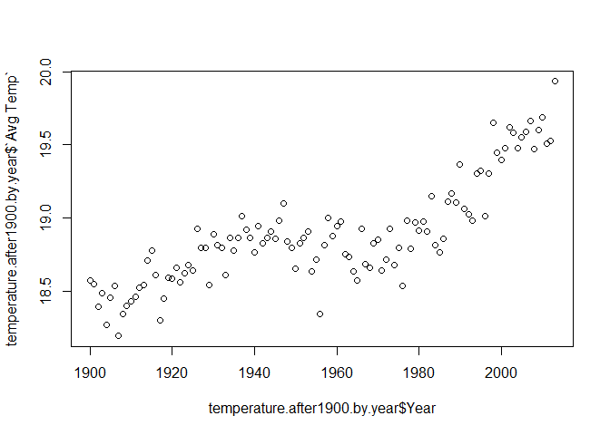

# CaseStudy2
Abhishek Dharwadkar  
December 8, 2016  


## R Markdown

This is an R Markdown document. This is the submission for Case Study 2 in Doing Data Science class

# Question 02 (15 points)


```r
# Install and load the package tseries
library(tseries)
```

```
## Warning: package 'tseries' was built under R version 3.3.2
```

```r
# Get the data for PSXP and calulate the returns and the volatility
LNNdata <- get.hist.quote('LNN', quote="Close")
LNNret <- log(lag(LNNdata)) - log(LNNdata)
LNNvol <- sd(LNNret) * sqrt(250) * 100

# Function to get volatility in continuous lookback window
Vol <- function(d, logrets) {
  var=0
  lam=0
  varlist<-c()
  for(r in logrets) {
    lam=lam*(1-1/d)+1
    var=(1-1/lam)*var+(1/lam)*r^2
    varlist<-c(varlist,var)
  }
  sqrt(varlist)
}

# Get different volatilities
volest <- Vol(10, LNNret)
volest2 <- Vol(30, LNNret)
volest3 <- Vol(100, LNNret)

plot(volest,type="l")
lines(volest2,type="l",col="red")
lines(volest3,type="l",col="blue")
```

<!-- -->

# Question 03 (20 points)

```r
tapply(Orange$circumference, Orange$Tree, mean)
```

```
##         3         1         5         2         4 
##  94.00000  99.57143 111.14286 135.28571 139.28571
```

```r
library(ggplot2)
plot(Orange$circumference,Orange$age,pch=as.integer(Orange$Tree),col=as.integer(Orange$Tree))
```

<!-- -->

```r
boxplot(Orange$circumference ~ Orange$Tree)
```

<!-- -->

# Question 04 (45 points)
# (i)

```r
# Set the working directory to where the file is located
setwd("C:\\Data Science\\SMU\\Semester1\\Doing Data Science\\CaseStudy_2")
# Read the csv file
temperature <- read.csv(".\\TEMP.csv", header = T)

# Check the file
dim(temperature)
```

```
## [1] 574223      4
```

```r
head(temperature)
```

```
##         Date Monthly.AverageTemp Monthly.AverageTemp.Uncertainty
## 1 1838-04-01              13.008                           2.586
## 2 1838-05-01                  NA                              NA
## 3 1838-06-01              23.950                           2.510
## 4 1838-07-01              26.877                           2.883
## 5 1838-08-01              24.938                           2.992
## 6 1838-09-01              18.981                           2.538
##       Country
## 1 Afghanistan
## 2 Afghanistan
## 3 Afghanistan
## 4 Afghanistan
## 5 Afghanistan
## 6 Afghanistan
```

```r
summary(temperature)
```

```
##        Date        Monthly.AverageTemp Monthly.AverageTemp.Uncertainty
##  1/1/1951:   242   Min.   :-37.66      Min.   : 0.05                  
##  1/1/1952:   242   1st Qu.: 10.16      1st Qu.: 0.32                  
##  1/1/1953:   242   Median : 21.00      Median : 0.57                  
##  1/1/1954:   242   Mean   : 17.26      Mean   : 1.01                  
##  1/1/1955:   242   3rd Qu.: 25.83      3rd Qu.: 1.20                  
##  1/1/1956:   242   Max.   : 38.84      Max.   :15.00                  
##  (Other) :572771   NA's   :32578       NA's   :31839                  
##                    Country      
##  Albania               :  3239  
##  Andorra               :  3239  
##  Austria               :  3239  
##  Belarus               :  3239  
##  Belgium               :  3239  
##  Bosnia And Herzegovina:  3239  
##  (Other)               :554789
```

```r
str(temperature)
```

```
## 'data.frame':	574223 obs. of  4 variables:
##  $ Date                           : Factor w/ 3239 levels "1/1/1900","1/1/1901",..: 1587 1588 1589 1590 1591 1592 1593 1594 1595 1596 ...
##  $ Monthly.AverageTemp            : num  13 NA 23.9 26.9 24.9 ...
##  $ Monthly.AverageTemp.Uncertainty: num  2.59 NA 2.51 2.88 2.99 ...
##  $ Country                        : Factor w/ 242 levels "Afghanistan",..: 1 1 1 1 1 1 1 1 1 1 ...
```

```r
# Check the class of the Date column and if there are any NAs in the file
class(temperature$Date)
```

```
## [1] "factor"
```

```r
sum(is.na(temperature$Date))
```

```
## [1] 0
```

```r
# Create a new variable Date.d as a date type with the format that is found after 1900
temperature$Date.d <- as.Date(temperature$Date, format = "%m/%d/%Y")
sum(is.na(temperature$Date.d))
```

```
## [1] 245720
```

```r
# Filter the data set to records after 1900
temperature.after1900 <- subset(temperature, !is.na(temperature$Date.d))

# Check the dataframe after subsetting
head(temperature.after1900)
```

```
##         Date Monthly.AverageTemp Monthly.AverageTemp.Uncertainty
## 742 1/1/1900              -3.428                           0.936
## 743 2/1/1900               1.234                           1.135
## 744 3/1/1900              10.545                           0.933
## 745 4/1/1900              13.352                           0.536
## 746 5/1/1900              20.260                           0.524
## 747 6/1/1900              24.448                           0.944
##         Country     Date.d
## 742 Afghanistan 1900-01-01
## 743 Afghanistan 1900-02-01
## 744 Afghanistan 1900-03-01
## 745 Afghanistan 1900-04-01
## 746 Afghanistan 1900-05-01
## 747 Afghanistan 1900-06-01
```

```r
# Calculate max and min in the dataset by country
min.temperature <- aggregate(temperature.after1900$Monthly.AverageTemp, by = list(temperature.after1900$Country), min, na.rm = T)
```

```
## Warning in FUN(X[[i]], ...): no non-missing arguments to min; returning Inf
```

```r
max.temperature <- aggregate(temperature.after1900$Monthly.AverageTemp, by = list(temperature.after1900$Country), max, na.rm = T)
```

```
## Warning in FUN(X[[i]], ...): no non-missing arguments to max; returning -
## Inf
```

```r
# Give the proper column names
colnames(min.temperature) <- c("Country", "min")
colnames(max.temperature) <- c("Country", "max")

# Merge the dataset by country and calculate the difference in max and min temperature
final.temperature <- merge(x = max.temperature, y = min.temperature, by="Country")
final.temperature$diff <- final.temperature$max - final.temperature$min

final.temperature <- final.temperature[order(-final.temperature$diff),]
final.temperature.top20 <- head(final.temperature, 20)

dim(final.temperature.top20)
```

```
## [1] 20  4
```

```r
barplot(final.temperature.top20$diff, names = final.temperature.top20$Country)
```

<!-- -->

# (ii) a,b,c

```r
# Set the working directory to where the file is located
setwd("C:\\Data Science\\SMU\\Semester1\\Doing Data Science\\CaseStudy_2")
# Read the csv file
temperature <- read.csv(".\\TEMP.csv", header = T)

# Check the class of the Date column and if there are any NAs in the file
class(temperature$Date)
```

```
## [1] "factor"
```

```r
sum(is.na(temperature$Date))
```

```
## [1] 0
```

```r
# Create a new variable Date.d as a date type with the format that is found after 1900
temperature$Date.d <- as.Date(temperature$Date, format = "%m/%d/%Y")
sum(is.na(temperature$Date.d))
```

```
## [1] 245720
```

```r
# Filter the data set to records after 1900
temperature.after1900 <- subset(temperature, !is.na(temperature$Date.d))

# Create the Faranheit column in the dataframe
temperature.after1900$Monthly.AverageTemp.F <- (temperature.after1900$Monthly.AverageTemp * 1.8) + 32

head(temperature.after1900)
```

```
##         Date Monthly.AverageTemp Monthly.AverageTemp.Uncertainty
## 742 1/1/1900              -3.428                           0.936
## 743 2/1/1900               1.234                           1.135
## 744 3/1/1900              10.545                           0.933
## 745 4/1/1900              13.352                           0.536
## 746 5/1/1900              20.260                           0.524
## 747 6/1/1900              24.448                           0.944
##         Country     Date.d Monthly.AverageTemp.F
## 742 Afghanistan 1900-01-01               25.8296
## 743 Afghanistan 1900-02-01               34.2212
## 744 Afghanistan 1900-03-01               50.9810
## 745 Afghanistan 1900-04-01               56.0336
## 746 Afghanistan 1900-05-01               68.4680
## 747 Afghanistan 1900-06-01               76.0064
```

```r
# Set the working directory to where the file is located
setwd("C:\\Data Science\\SMU\\Semester1\\Doing Data Science\\CaseStudy_2")
# Read the csv file
temperature <- read.csv(".\\TEMP.csv", header = T)

# Check the class of the Date column and if there are any NAs in the file
class(temperature$Date)
```

```
## [1] "factor"
```

```r
sum(is.na(temperature$Date))
```

```
## [1] 0
```

```r
# Create a new variable Date.d as a date type with the format that is found after 1900
temperature$Date.d <- as.Date(temperature$Date, format = "%m/%d/%Y")
sum(is.na(temperature$Date.d))
```

```
## [1] 245720
```

```r
# Filter the data set to records after 1900
temperature.after1900 <- subset(temperature, !is.na(temperature$Date.d))

# Create the Faranheit column in the dataframe
temperature.after1900$Monthly.AverageTemp.F <- (temperature.after1900$Monthly.AverageTemp * 1.8) + 32

head(temperature.after1900)
```

```
##         Date Monthly.AverageTemp Monthly.AverageTemp.Uncertainty
## 742 1/1/1900              -3.428                           0.936
## 743 2/1/1900               1.234                           1.135
## 744 3/1/1900              10.545                           0.933
## 745 4/1/1900              13.352                           0.536
## 746 5/1/1900              20.260                           0.524
## 747 6/1/1900              24.448                           0.944
##         Country     Date.d Monthly.AverageTemp.F
## 742 Afghanistan 1900-01-01               25.8296
## 743 Afghanistan 1900-02-01               34.2212
## 744 Afghanistan 1900-03-01               50.9810
## 745 Afghanistan 1900-04-01               56.0336
## 746 Afghanistan 1900-05-01               68.4680
## 747 Afghanistan 1900-06-01               76.0064
```

```r
# Create a new column that has just the value of the year
temperature.after1900$Year <- format(as.Date(temperature.after1900$Date.d), format = "%Y")
head(temperature.after1900)
```

```
##         Date Monthly.AverageTemp Monthly.AverageTemp.Uncertainty
## 742 1/1/1900              -3.428                           0.936
## 743 2/1/1900               1.234                           1.135
## 744 3/1/1900              10.545                           0.933
## 745 4/1/1900              13.352                           0.536
## 746 5/1/1900              20.260                           0.524
## 747 6/1/1900              24.448                           0.944
##         Country     Date.d Monthly.AverageTemp.F Year
## 742 Afghanistan 1900-01-01               25.8296 1900
## 743 Afghanistan 1900-02-01               34.2212 1900
## 744 Afghanistan 1900-03-01               50.9810 1900
## 745 Afghanistan 1900-04-01               56.0336 1900
## 746 Afghanistan 1900-05-01               68.4680 1900
## 747 Afghanistan 1900-06-01               76.0064 1900
```

```r
# Aggregate temperatures by Year
temperature.after1900.by.year <- aggregate(temperature.after1900$Monthly.AverageTemp, by = list(temperature.after1900$Year), mean, na.rm = T)

# Give meaningful column names to the aggregated data
colnames(temperature.after1900.by.year) <- c("Year", "Avg Temp")

# Plot the Year vs Avg temperature plot
plot(temperature.after1900.by.year$Year, temperature.after1900.by.year$`Avg Temp`)
```

<!-- -->

```r
# Calculate the differenct in average temperature with the previous year
temperature.after1900.by.year$Year_diff <- c(0, diff(temperature.after1900.by.year$`Avg Temp`, lag = 1, differences = 1))
temperature.after1900.by.year$Abs_year_diff <- abs(temperature.after1900.by.year$Year_diff)

temperature.after1900.by.year.max.diff <- temperature.after1900.by.year[order(temperature.after1900.by.year$Abs_year_diff, decreasing = T, na.last = T),]

head(temperature.after1900.by.year.max.diff, 1)
```

```
##    Year Avg Temp Year_diff Abs_year_diff
## 58 1957 18.81424 0.4675591     0.4675591
```

# (iii) a,b

```r
# City Temp Data
# Set the working directory to where the file is located
setwd("C:\\Data Science\\SMU\\Semester1\\Doing Data Science\\CaseStudy_2")
# Read the csv file
City.temperature <- read.csv(".\\CityTemp.csv", header = T)

# Check the data
dim(City.temperature)
```

```
## [1] 237200      7
```

```r
head(City.temperature)
```

```
##         Date Monthly.AverageTemp Monthly.AverageTemp.Uncertainty
## 1 1850-01-01              15.986                           1.537
## 2 1850-02-01              18.345                           1.527
## 3 1850-03-01              18.632                           2.162
## 4 1850-04-01              18.154                           1.693
## 5 1850-05-01              17.480                           1.237
## 6 1850-06-01              17.183                           1.252
##          City  Country Latitude Longitude
## 1 Addis Abeba Ethiopia    8.84N    38.11E
## 2 Addis Abeba Ethiopia    8.84N    38.11E
## 3 Addis Abeba Ethiopia    8.84N    38.11E
## 4 Addis Abeba Ethiopia    8.84N    38.11E
## 5 Addis Abeba Ethiopia    8.84N    38.11E
## 6 Addis Abeba Ethiopia    8.84N    38.11E
```

```r
summary(City.temperature)
```

```
##        Date        Monthly.AverageTemp Monthly.AverageTemp.Uncertainty
##  1/1/1900:    99   Min.   :-26.77      Min.   : 0.040                 
##  1/1/1901:    99   1st Qu.: 12.62      1st Qu.: 0.340                 
##  1/1/1902:    99   Median : 20.33      Median : 0.593                 
##  1/1/1903:    99   Mean   : 18.06      Mean   : 0.972                 
##  1/1/1904:    99   3rd Qu.: 25.88      3rd Qu.: 1.324                 
##  1/1/1905:    99   Max.   : 38.28      Max.   :14.037                 
##  (Other) :236606   NA's   :10802       NA's   :10802                  
##        City                 Country          Latitude     
##  Berlin  :  3239   India        : 36582   31.35N : 13875  
##  Chicago :  3239   China        : 35444   40.99N : 11930  
##  Istanbul:  3239   Brazil       : 12930   39.38N :  9954  
##  Kiev    :  3239   Turkey       :  9473   23.31N :  9924  
##  London  :  3239   United States:  8455   37.78N :  9862  
##  Madrid  :  3239   Egypt        :  7589   29.74N :  9078  
##  (Other) :217766   (Other)      :126727   (Other):172577  
##    Longitude     
##  31.38E :  6801  
##  77.27E :  5226  
##  80.60E :  5226  
##  73.51E :  4742  
##  116.53E:  4636  
##  103.66E:  4583  
##  (Other):205986
```

```r
str(City.temperature)
```

```
## 'data.frame':	237200 obs. of  7 variables:
##  $ Date                           : Factor w/ 3239 levels "1/1/1900","1/1/1901",..: 1728 1729 1730 1731 1732 1733 1734 1735 1736 1737 ...
##  $ Monthly.AverageTemp            : num  16 18.3 18.6 18.2 17.5 ...
##  $ Monthly.AverageTemp.Uncertainty: num  1.54 1.53 2.16 1.69 1.24 ...
##  $ City                           : Factor w/ 99 levels "Addis Abeba",..: 1 1 1 1 1 1 1 1 1 1 ...
##  $ Country                        : Factor w/ 48 levels "Afghanistan",..: 14 14 14 14 14 14 14 14 14 14 ...
##  $ Latitude                       : Factor w/ 49 levels "0.80N","0.80S",..: 48 48 48 48 48 48 48 48 48 48 ...
##  $ Longitude                      : Factor w/ 92 levels "0.00W","103.66E",..: 48 48 48 48 48 48 48 48 48 48 ...
```

```r
# Check the class of the Date column and if there are any NAs in the file
class(City.temperature$Date)
```

```
## [1] "factor"
```

```r
sum(is.na(City.temperature$Date))
```

```
## [1] 0
```

```r
# Create a new variable Date.d as a date type with the format that is found after 1900
City.temperature$Date.d <- as.Date(City.temperature$Date, format = "%m/%d/%Y")
sum(is.na(City.temperature$Date.d))
```

```
## [1] 102065
```

```r
head(City.temperature, 10)
```

```
##          Date Monthly.AverageTemp Monthly.AverageTemp.Uncertainty
## 1  1850-01-01              15.986                           1.537
## 2  1850-02-01              18.345                           1.527
## 3  1850-03-01              18.632                           2.162
## 4  1850-04-01              18.154                           1.693
## 5  1850-05-01              17.480                           1.237
## 6  1850-06-01              17.183                           1.252
## 7  1850-07-01              16.449                           1.265
## 8  1850-08-01              16.358                           1.232
## 9  1850-09-01              16.184                           1.200
## 10 1850-10-01              15.616                           1.331
##           City  Country Latitude Longitude Date.d
## 1  Addis Abeba Ethiopia    8.84N    38.11E   <NA>
## 2  Addis Abeba Ethiopia    8.84N    38.11E   <NA>
## 3  Addis Abeba Ethiopia    8.84N    38.11E   <NA>
## 4  Addis Abeba Ethiopia    8.84N    38.11E   <NA>
## 5  Addis Abeba Ethiopia    8.84N    38.11E   <NA>
## 6  Addis Abeba Ethiopia    8.84N    38.11E   <NA>
## 7  Addis Abeba Ethiopia    8.84N    38.11E   <NA>
## 8  Addis Abeba Ethiopia    8.84N    38.11E   <NA>
## 9  Addis Abeba Ethiopia    8.84N    38.11E   <NA>
## 10 Addis Abeba Ethiopia    8.84N    38.11E   <NA>
```

```r
# Filter the data set to records after 1900
City.temperature.after1900 <- subset(City.temperature, !is.na(City.temperature$Date.d))

head(City.temperature.after1900, 10)
```

```
##          Date Monthly.AverageTemp Monthly.AverageTemp.Uncertainty
## 601  1/1/1900              17.019                           1.073
## 602  2/1/1900              18.153                           0.772
## 603  3/1/1900              19.110                           0.954
## 604  4/1/1900              19.492                           0.887
## 605  5/1/1900              18.353                           2.247
## 606  6/1/1900              17.619                           0.948
## 607  7/1/1900              15.851                           1.987
## 608  8/1/1900              16.312                           1.226
## 609  9/1/1900              17.168                           0.874
## 610 10/1/1900              16.092                           2.190
##            City  Country Latitude Longitude     Date.d
## 601 Addis Abeba Ethiopia    8.84N    38.11E 1900-01-01
## 602 Addis Abeba Ethiopia    8.84N    38.11E 1900-02-01
## 603 Addis Abeba Ethiopia    8.84N    38.11E 1900-03-01
## 604 Addis Abeba Ethiopia    8.84N    38.11E 1900-04-01
## 605 Addis Abeba Ethiopia    8.84N    38.11E 1900-05-01
## 606 Addis Abeba Ethiopia    8.84N    38.11E 1900-06-01
## 607 Addis Abeba Ethiopia    8.84N    38.11E 1900-07-01
## 608 Addis Abeba Ethiopia    8.84N    38.11E 1900-08-01
## 609 Addis Abeba Ethiopia    8.84N    38.11E 1900-09-01
## 610 Addis Abeba Ethiopia    8.84N    38.11E 1900-10-01
```

```r
# Calculate max and min in the dataset by City
min.temperature.by.city <- aggregate(City.temperature.after1900$Monthly.AverageTemp, by = list(City.temperature.after1900$City), min, na.rm = T)
max.temperature.by.city <- aggregate(City.temperature.after1900$Monthly.AverageTemp, by = list(City.temperature.after1900$City), max, na.rm = T)

colnames(min.temperature.by.city) <- c("City", "min")
colnames(max.temperature.by.city) <- c("City", "max")

# Merge the dataset by country and calculate the difference in max and min temperature
final.temperature.by.city <- merge(x = max.temperature.by.city, y = min.temperature.by.city, by="City")
final.temperature.by.city$diff <- final.temperature.by.city$max - final.temperature.by.city$min

# Order descending difference
final.temperature.by.city <- final.temperature.by.city[order(-final.temperature.by.city$diff),]
final.temperature.by.city.top20 <- head(final.temperature.by.city, 20)

dim(final.temperature.by.city.top20)
```

```
## [1] 20  4
```

```r
barplot(final.temperature.by.city.top20$diff, names = final.temperature.by.city.top20$City)
```

<!-- -->

```r
# Comparing the graphs below are a few observations:
# 1.	Being the highest difference in the city does not mean the highest difference in the country and vice versa
# 2.	The top 3rd city is Moscow and the top 3rd country is Russia which is a coincidence.
# 3.	Also, there is a pattern, lot of cities in China and Russia are in the top differences and hence the country is also in the top
```
